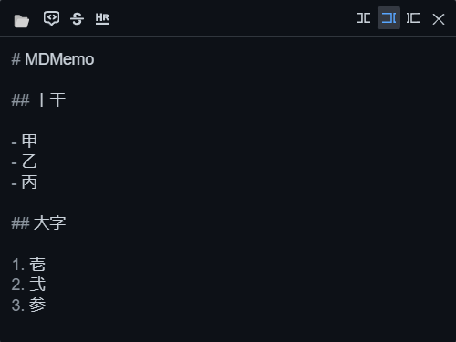
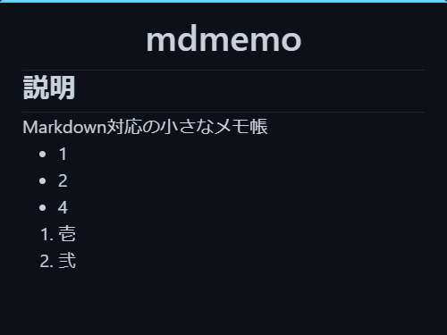

<div align="center">


[](https://github.com/yutotnh/mdmemo/actions/workflows/github-code-scanning/codeql)
[](https://github.com/yutotnh/mdmemo/actions/workflows/build-test.yml)

</div>

# MDMemo

Markdown対応の小さなメモ帳

[Tauri](https://tauri.app/) + [react-md-editor](https://uiwjs.github.io/react-md-editor/) を利用しています

## 画面

編集モードとプレビューモードが存在します

ウィンドウがアクティブウィンドウの場合に編集モードになり、非アクティブウィンドウの時にプレビューモードになります

- 編集モード

    

- プレビューモード

    

## Development

リポジトリを持ってきてアプリケーションを起動するまでの流れは以下の通りです

```console
git clone https://github.com/yutotnh/mdmemo.git
cd mdmemo
yarn install
yarn tauri dev
```
