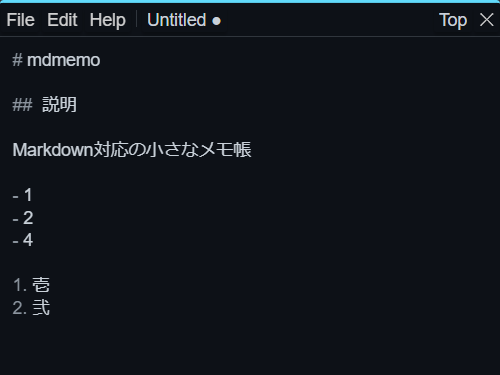

<div align="center">


[](https://github.com/yutotnh/mdmemo/actions/workflows/github-code-scanning/codeql)
[](https://github.com/yutotnh/mdmemo/actions/workflows/build-test.yml)

</div>

# MDMemo

Markdown対応の小さなメモ帳

[Tauri](https://tauri.app/) + [react-md-editor](https://uiwjs.github.io/react-md-editor/) を利用しています

## 画面

編集画面とプレビュー画面が存在します

ウィンドウがアクティブウィンドウの場合に編集画面になり、非アクティブウィンドウの時にプレビュー画面になります

<style>
  .container {
    display: flex;
    flex-wrap: wrap;
  }

  .item {
    width: 350px;
    margin: 10px;
    text-align: center;
  }
</style>

<div class="container">
  <div class="item">
    <p>編集画面</p>
    
  </div>
  <div class="item">
    <p>プレビュー画面</p>
    
  </div>
</div>

## Development

リポジトリを持ってきてアプリケーションを起動するまでの流れは以下の通りです

```console
git clone https://github.com/yutotnh/mdmemo.git
cd mdmemo
yarn install
yarn tauri dev
```
